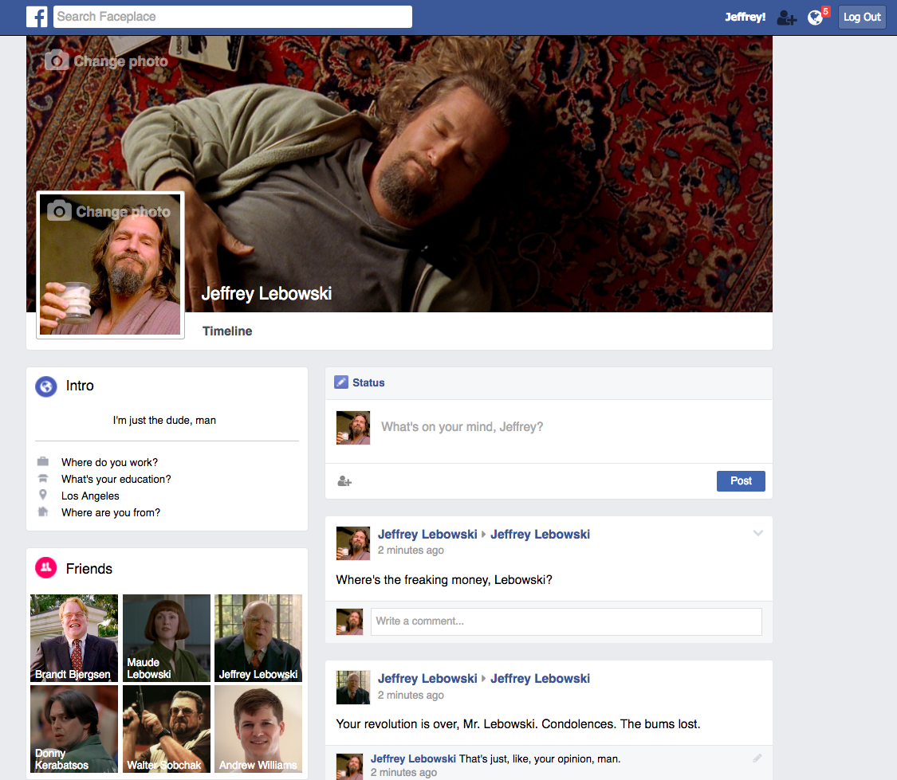

# faceplace

[faceplace on Heroku](http://www.faceplace.io)

faceplace is a full-stack web application inspired by Facebook. Notable technologies include Ruby on Rails and a PostgreSQL database on the back-end laying the foundation for a React.js front-end built in the Flux architectural style.

## Features & Implementation

#### Single-Page App

faceplace is implemented fully in one single page, the effect of navigating to separate pages having been achieved via React Router. Deep authentication via password- and session-token-comparison is implemented on the back-end, while shallow authentication works on the front-end via a Flux 'Session Store' which keeps the current user's ID in a private variable.

#### Friending

The core feature, friendships, are stored in a 'friendships' join table which connects users via their user ID's. An intermediate step, friend-requesting, gives users the chance to consider their friendship requests and is implemented through a very similar table called 'friend_requests'. On the front end, JSON objects representing a users's friends are received on visiting a user profile page and stored in a 'Friend Store'.

Via Ajax requests which send and receive data to the server asynchronously, friending and unfriending provide meaningful feedback to the user almost instantly: every interaction that depends on friendships have a listener on the 'Friend Store' and update independently any time new data about friendships is received. For example, accepting a friend request from a user named Alex while on Alex's profile page triggers adding a form to post on Alex's timeline.

#### User Search

Thanks to the user search bar, finding new friends is as simple as typing the first couple letters of either their first or last name. Results of the search are fetched on change with each character addition and deletion on the input field.

SQL injection is cleaned up by sanitized parameters on the back-end!

#### Tagging

There is a searchable drop-down on the post component which allows a user to tag his or her friends on the post. Friends tagged are displayed on the component below the body of the post and are available both on the author's timeline and on each tagged user's timeline.

#### Posting to a friend's timeline

When visiting a friend's profile page, the post form is available and on submission posts directly to the author's timeline and to the profile owner's timeline. Information about such friend-timeline-posts is displayed above the body of the post.

#### Cover photo

When viewing one's own profile page, a small button appears over the cover in the top-left corner prompting the user to change his or her cover photo. Changing the cover photo updates the corresponding cover photo in the 'users' table and via Ajax, almost instantly updates the cover photo on the front-end.

#### Intro

The intro stores basic personal information input by a user on his or her own profile page for public consumption. With React, dynamically setting these items as either 'show' items displaying the profile information or 'edit' items containing a form and input fields provides a visually appealing, easy-to-use dual-role component.

## To-Do for this project:

I am very happy with the results achieved thus far on faceplace, but am nonetheless excited and driven to continue working on its development. Some craved features include...

#### Commenting

In the future, users will be able to comment on each other's posts. Comment authors **and** the author of the original post will be able to delete comments. Comment authors will be able to edit their comments.

#### Photo status updates and photo albums

In the future, users will be able to upload a photo instead of providing a body of text for their posts. Photos will all be stored on the back-end in a photos table and a join table 'photo albums' will store data relating photos to their owners and their containing albums.

#### Notifications

In the future, notifications will appear at the top of the screen to show a user when he or she has been friended, tagged, or his or her timeline has been posted on.

#### Private messages

In the future, users will be able to send simple messages back and forth to each other. The messages table will be quite similar to the (future) posts table in that it will allow for either text or a photo for the body content.

#### Live updates via web sockets

In the future, after implementing notifications and messages, users will be updated live via web sockets on receipt of a notification, message, or friend request.
